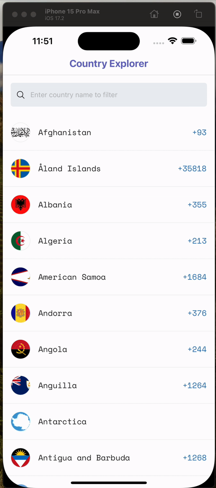
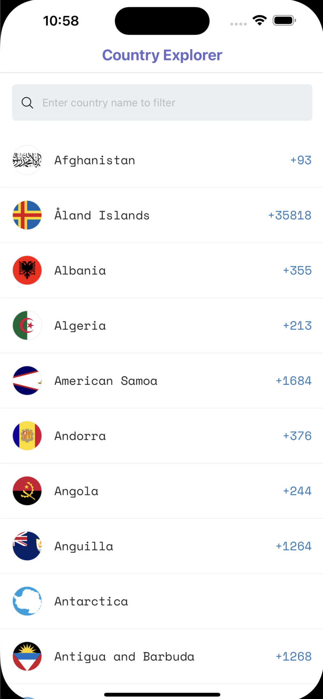
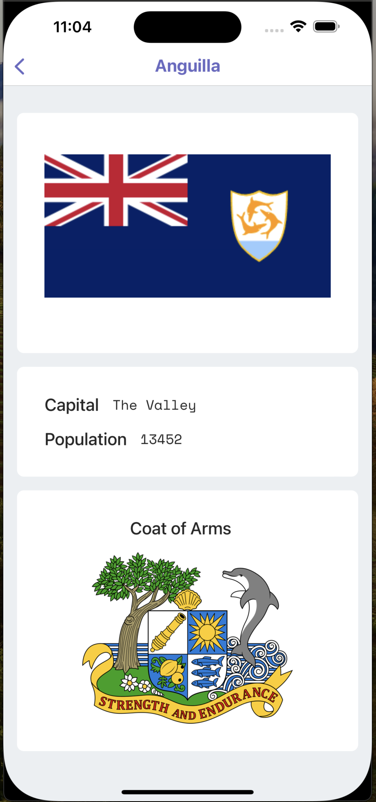

# React Native - Country Explorer

A react Native app to search the country and see some details about country. Project uses [Expo SDK](https://docs.expo.dev/) to manage and build app. Read about [Expo Development Process] to know more. Data for the app is fetched from [Rest Countries](https://restcountries.com/).

## Demo Gif

<div align="center">

</div>

## Table of contents

- [ React Native - Country Explorer](#react-native---country-explorer)
- [Demo Gif](#demo-gif)
- [Pre-requisites](#pre-requisites)
- [Requirements](#requirements)
- [How to run](#how-to-run)
  - [Development mode](#development-mode)
- [Deployed Version](#deployed-version)
- [Folder structure](#folder-structure)
- [Available Screens](#available-screens)
- [Things to Improve](#things-to-improve)

## Pre-requisites

1. `node` >= 18

## Requirements

| Requirement  | Status | Description                                       | Information Shown                                                 |
| ------------ | ------ | ------------------------------------------------- | ----------------------------------------------------------------- |
| Homepage     | ✅     | A Screen to show list of countries and search bar | Flag Icon, Country Name, Country Code                             |
| Search bar   | ✅     | A search bar to search the countries              | Search Icon, Input box, Clear Icon                                |
| Details Page | ✅     | A Screen to see details of selected country       | Country flag, Flag description, Capital, Population, Coat of Arms |

## How to run

### Development mode

1. Clone the repo via
   ```sh
    git clone https://github.com/thejsdeveloper/country-explorer.git
   ```
2. Go to project directory
   ```sh
    cd country-explorer
   ```
3. Install Dependencies
   ```sh
    yarn install
    # or
    npm install
   ```
4. Run the following command to build the application in dev mode.
   ```sh
    yarn start
    # or
    npm run start
   ```
5. You will the see the following output when the build is done. It will render a QR code which you can scan in Expo Go app to run the app

   ```sh
   Starting Metro Bundler
   ➜ Metro waiting on exp://192.168.1.4:8081
   ➜ Scan the QR code above with Expo Go (Android) or the Camera app (iOS)
   ➜ Web is waiting on http://localhost:8081

   ➜ Using Expo Go
   ➜ Press s │ switch to development build
   ➜ Press a │ open Android
   ➜ Press i │ open iOS simulator
   ➜ Press w │ open web
   ➜ Press j │ open debugger
   ➜ Press r │ reload app
   ➜ Press m │ toggle menu
   ➜ Press o │ open project code in your editor
   ➜ Press ? │ show all commands

      Local:   http://localhost:5173/
     ➜  Network: use --host to expose
     ➜  press h + enter to show help

   ```

6. To see the app you can download the [Expo Go] app and scan the QR shown in console.

7. Done.

### Deployed Version

I have deployed the app using [EAS] (Expo Application services)
If you want to see the deployed app Download the [Expo Go] app and scan below QR

#### iOS
<div align="center">

</div>

#### Android
<div align="center">

</div>

Once QR is scanned successfully, you will be able to see following screen

<div align="center">
 
</div>

## Folder structure

```sh
- app  # App Routing folder
  |- countries # countries route
  | |
  | |-[countryName].tsx # Route which will match '/countries/${countryName}'
  | |
  |- layout.tsx # This is used for layout and loading main dependencies like fonts
  |- +not-found.tsx # This will be rendered when no route is match
  |- index.tsx # Homepage Screen this is matched with '/' route
- constants # sharable constants
- utils # helper functions
- components # sharable components for screens
- hooks # reusable hooks
- types # types for the data
```

## Available Routes

I am using [Expo Router] to manage the routing.

```sh
- / # This is main or home route which will load the Country Listing screen
- /country/{countryName}?countryCode={code} # This will reader the country details screen.
```

## Available Screens

| Route                                      | Page         | Screen                                                            |
| ------------------------------------------ | ------------ | ----------------------------------------------------------------- |
| `/`                                        | Homepage     |  |
| `country/{countryName}?countryCode={code}` | Details page |   |

## Things to Improve

I think we can do some improvement in current app to make it more efficient and user friendly.

- **Offline support**:  We can use [Asyc storage] to store the countries and show it even when user is offline.
- We can show more details like country' `map` and its `geographical details` which we receive in the response.
- We can give option to sort the countries on home page 
- For more immersive experience we can also [Generate Blur Hash on Server] for a placeholder image using [Blur Hash] which is supported by default on [Expo image]

<p align=center>--- End ---</p>

<!-- References -->

[Expo Go]: https://expo.dev/client
[EAS]: https://expo.dev/eas
[Expo Development Process]: https://docs.expo.dev/workflow/overview/
[Expo Router]: https://docs.expo.dev/router/introduction/
[Asyc storage]: https://react-native-async-storage.github.io/async-storage/docs/usage/
[Blur Hash]: https://blurha.sh/
[Generate Blur Hash on Server]: https://docs.expo.dev/versions/latest/sdk/image/#generating-a-blurhash-on-a-server
[Expo image]: https://docs.expo.dev/versions/latest/sdk/image/
